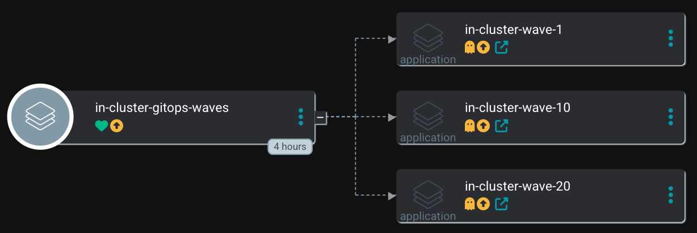
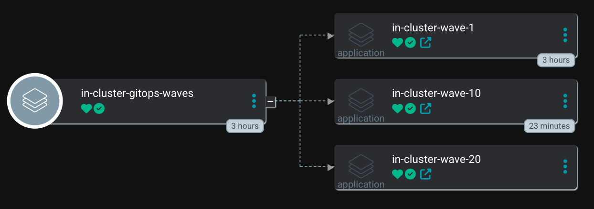

# Creating Argo CD Application Dependencies - Waves

## Introduction

Working with Argo CD and leveraging the GitOps approach is a great way to manage the configurations of your different clusters.
Since ApplicationSets, it is easy to automatically create different Argo CD Application objects that are rolled out to the environments. However, sometimes it happens that 
a service depends on other services before it can be deployed. By design, an Application is completely autonomous and does not know the status of other Applications. Therefore, it will be challenging to configure Application dependencies and let Argo CD know when to start the deployment of the next service. 

For example, before OpenShift-Logging can be configured, the Loki Operator and a LokiStack object must have been created. You could now create a single Application object that
is responsible for both services. The problem is however that other services depend on Loki too, like the Netobserv Operator. Bundling this into the same Application will become confusing at some point as a single Argo CD Application gets huge. 

On the other hand, if you create a 2nd Application that also tries to install the Loki Operator Argo CD will show a warning message in the UI, since an object should be managed by one Application only. 

So how to deal with such an issue? The answer is to use **App-of-Apps** pattern, custom **resource health checks** and **Syncwaves**. 

## App-of-Apps
The [App-of-Apps](https://argo-cd.readthedocs.io/en/stable/operator-manual/cluster-bootstrapping/) pattern was introduced to create a single Argo CD Application that manages other Argo CD Applications (One to rule them all). In other words: A single App-of-App that will manage the Applications that will further deploy Loki, Logging etc. In our example below, this will be the starting point.

## SyncWaves
With Syncwaves it is possible to define an order for Argo CD which will apply the managed manifests to the system. The lower the syncwave number, the earlier the object will be created. A classic example are Namespace and Deployment. It is a good thing to first deploy a Namespace before anything else:

- Namespace - Syncwave 0 
- Deployment - Syncwave 1 

This means that the Namespace object will be created first and only after it has been created (reported a healthy status to Argo CD) Argo CD will create the Deployment object. 

## Combining App-of-Apps and Syncwaves
In the following example, I will create an **App-of-Apps** that will take care of three other Applications that all have a Syncwave configured accordingly. The [App-of-Apps](https://github.com/tjungbauer/blog-gitops-app-dependencies/blob/main/simplified-waves/apps/controller/apps-of-apps.yaml) will roll out the changes in "**Waves**". I created three waves are a demonstration:

- wave-1 - syncwave 1, includes a PostSync hook.
- wave-10 - syncwave 10
- wave-20 - syncwave 20

These are the *managed* Applications. Each Application is pointing to the sub-folder [waves](https://github.com/tjungbauer/blog-gitops-app-dependencies/tree/main/simplified-waves/waves) where the actual configuration is stored.

The idea is to synchronize the App-of-App which will wait for the first (managed) Application before it starts with the second one and so on.

## Prerequisites
To be able for the App-of-Apps to verify the status of the managed Applications a **Health Check** must be configured in Argo CD. Such a check can be used to track the status of different Kubernetes objects. Only if the status "**healthy**" is returned for all Kubernetes manifests, Argo CD will consider the whole Application as "healthy"

There are some built-in health checks. However, for the Application object itself, the health check has been removed in Argo CD version 1.8. You can read more about this change in [Issue 3781](https://github.com/argoproj/argo-cd/issues/3781).

Well ... we can create a custom health check and bring this functionality back. 

The following configuration can be added to the **openshift-gitops** operator:

```yaml
  resourceHealthChecks:
    - check: |
        hs = {}
        hs.status = "Progressing"
        hs.message = ""
        if obj.status ~= nil then
          if obj.status.health ~= nil then
            if obj.status.health.message ~= nil then
              hs.message = obj.status.health.message
            end
          end
          if obj.status.operationState ~= nil then
            if obj.status.operationState.phase == "Running" or obj.status.operationState.phase == "Terminating" then 
              hs.status = "Progressing"
            elseif obj.status.operationState.phase == "Degraded" or obj.status.operationState.phase == "Error" or obj.status.operationState.phase == "Failed" then
              hs.status = "Degraded"
              if obj.status.operationState.message ~= nil then
                hs.message = obj.status.operationState.message
              end
            elseif obj.status.operationState.phase == "Succeeded" then
              hs.status = obj.status.health.status
            else
              hs.status = "Unknown"
            end
          else
            -- for the main App of Apps that does not automatically sync the Apps.
            if obj.status.sync.status == "OutOfSync" and obj.status.health.status == "Healthy" then
              hs.status = "Missing"
              hs.message = "Out of Sync"
            end
            if obj.status.sync.status == "OutOfSync" and obj.status.health.status == "Missing" then
              hs.status = "Missing"
              hs.message = "Out of Sync"
            end
          end
        end
        if obj.status.sync.status == "Unknown" then
          hs.status = "Degraded"
          hs.message = "Something went wrong, status degraded. Verify the Argo CD Application"
        end
        return hs
      group: argoproj.io
      kind: Application
```

If you do not use the Operator, you can add the same configuration to the Argo CD ConfigMap **argocd-cm**.

The syntax of such health checks is described at [Custom Health Checks](]https://argo-cd.readthedocs.io/en/stable/operator-manual/health/#argocd-app).

It verifies if the status is healthy and reports this status to Argo CD.

**NOTE**: By default, an Argo CD Application is considered "healthy" when the **Sync** phase is finished and it does not care about possible **PostSync** hook ([Hook Documentation](https://argo-cd.readthedocs.io/en/stable/user-guide/resource_hooks/)). This is the reason why there are a lot of "ifs" in the check above, which are required to manage PostSync phases too. If you do not verify the **PostSync** status the Application will report a healthy status back, although PostSync is still being executed ... and we want to whole Application to finish before we do anything else.


## Demo - Simplified
I have prepared a very simple example of these waves in the folder: [simplified-waves](https://github.com/tjungbauer/blog-gitops-app-dependencies/tree/main/simplified-waves). 
All it does is to create three waves with a Job that is running for 15 seconds. In addition, wave-0 also has a PostSync Job (also running for 15 seconds).

The App-of-Apps (the controller) will manage three Applications that take care of the services.

All we need to do is create the App-of-Apps

```yaml
apiVersion: argoproj.io/v1alpha1
kind: Application
metadata:
  name: in-cluster-gitops-waves
  namespace: openshift-gitops
  annotations:
    argocd.argoproj.io/sync-wave: "0"
spec:
  destination:
    name: in-cluster
    namespace: default
  info:
    - name: Description
      value: Waves of applications that are dependent to each other, for example Loki, openshift-logging or NetObserv Operator
  project: in-cluster
  source:
    path: simplified-waves/apps/managed
    repoURL: 'https://github.com/tjungbauer/blog-gitops-app-dependencies'
    targetRevision: main
  syncPolicy:
    syncOptions:
      - ApplyOutOfSyncOnly=true
```

The following image shows the App-of-App in Argo CD:



**Note**: I did not configure the App-of-Apps to automatically synchronize, so you need to click the "Sync" button in Argo CD to start the process. Still will start the synchronization in the required order. 

For example, wave-0 will deploy a Job that is running for 15 seconds, after that it will perform a PostSync action, that is also running for 15 seconds. 
Once all objects (including the PostSync hook) in this Application have been created and are healthy, the next wave (wave-10) will be started.

Eventually, all waves are finished and the whole App-of-App is healthy. 



## Demo - Loki, Logging and Netobserv
A second example can be found at [GitHub](https://github.com/tjungbauer/blog-gitops-app-dependencies/tree/main/gitops-waves) that will perform the following actions:

1. Loki Operator (wave-1) creates the object: Loki Operator
2. OpenShift-Logging - (wave-10) creates the objects: Openshift-Operator, BucketClaim, LokiStack, ClusterLogging
3. Netobserv - (wave-20) creates the objects: Netobserv Operator, BucketClaim, LokiStack, FlowController

**NOTE**: Loki requires an object storage (s3). In this example, I am using OpenShift Data Foundation (ODF). ODF is not part of this wave-example, since every user might use a different S3 solution and since it was already deployed on the cluster. 


## What about ApplicationSets?
Weren't ApplicationSets introduced to replace the App-of-Apps pattern? Well, the ApplicationSets are an evolution of the App-of-Apps pattern. Unfortunately, there is one problem with ApplicationSets. Currently, it is not possible to configure Application dependencies with ApplicationSets (ApplicationSets do not know Syncwaves). There is an open feature request that might deal with this in the future [Issue 221](https://github.com/argoproj/applicationset/issues/221).

